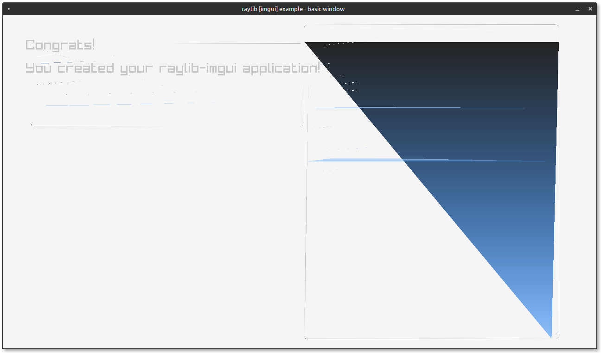

# raylib-imgui

Use [dear imgui](https://github.com/ocornut/imgui) in [raylib](https://www.raylib.com)? This needs some work. If you know how to properly render vertices in rlgl, feel free to try to hack this out one.



## Build

```
mkdir build
cd build
cmake ..
make
```
